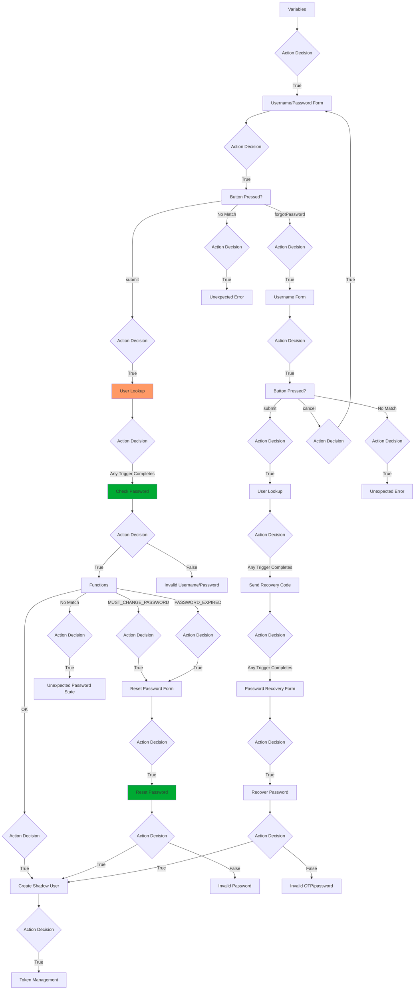

# "User Lookup" - matchedUser.id (ID: local.icv9ot1nro.payload.output.matchedUser.id)

## Data Path

Orange = Variable written
Green = Variable Read

```mermaid
flowchart TD
    lz4v4r9c4m[Variables] --> A{Action Decision}
    A -->|True| howu8n9hsc[Username/Password Form]
    howu8n9hsc --> B{Action Decision}
    B -->|True| uob50pnvdv[Button Pressed?]
    uob50pnvdv -->|submit| C{Action Decision}
    C -->|True| icv9ot1nro[User Lookup]:::write
    icv9ot1nro --> F{Action Decision}
    F -->|Any Trigger Completes| dnu7jt3sjz[Check Password]:::read
    uob50pnvdv -->|forgotPassword| D{Action Decision}
    D -->|True| 8m0sspk0ee[Username Form]
    uob50pnvdv -->|No Match| E{Action Decision}
    E -->|True| 0mkskx7cez[Unexpected Error]
    dnu7jt3sjz --> G{Action Decision}
    G -->|True| 3of58vu7g8[Functions]
    G -->|False| kkii6sbmvk[Invalid Username/Password]
    3of58vu7g8 -->|MUST_CHANGE_PASSWORD| H{Action Decision}
    3of58vu7g8 -->|PASSWORD_EXPIRED| I{Action Decision} 
    3of58vu7g8 -->|OK| J{Action Decision}
    3of58vu7g8 -->|No Match| K{Action Decision}
    H -->|True| j9ekv98w5p[Reset Password Form]
    I -->|True| j9ekv98w5p
    J -->|True| 760w48p7zi[Create Shadow User]
    K -->|True| nf63ecqmal[Unexpected Password State]
    j9ekv98w5p --> L{Action Decision}
    L -->|True| ldguma4s6x[Reset Password]:::read
    ldguma4s6x --> M{Action Decision}
    M -->|True| 760w48p7zi
    M -->|False| 7ohg6pe1wu[Invalid Password]
    760w48p7zi --> N{Action Decision}
    N -->|True| ck1mtmjp5b[Token Management]
    8m0sspk0ee --> O{Action Decision}
    O -->|True| tqhsdpjiev[Button Pressed?]
    tqhsdpjiev -->|submit| P{Action Decision}
    tqhsdpjiev -->|cancel| Q{Action Decision}
    tqhsdpjiev -->|No Match| R{Action Decision}
    P -->|True| o9qu0nvyje[User Lookup]
    Q -->|True| howu8n9hsc
    R -->|True| qib48jbqzt[Unexpected Error]
    o9qu0nvyje --> S{Action Decision}
    S -->|Any Trigger Completes| fhz3x7ukuh[Send Recovery Code]
    fhz3x7ukuh --> T{Action Decision}
    T -->|Any Trigger Completes| k1vc9enhqp[Password Recovery Form]
    k1vc9enhqp --> U{Action Decision}
    U -->|True| lo3onszyab[Recover Password]
    lo3onszyab --> V{Action Decision}
    V -->|True| 760w48p7zi
    V -->|False| xe7a3y02pq[Invalid OTP/password]
    
    classDef write fill:#f96
    classDef read fill:#0A3

    click lz4v4r9c4m "#lz4v4r9c4m" "Doc"
    click howu8n9hsc "#howu8n9hsc" "Doc"
    click uob50pnvdv "#uob50pnvdv" "Doc"
    click icv9ot1nro "#icv9ot1nro" "Doc"
    click 8m0sspk0ee "#8m0sspk0ee" "Doc"
    click 0mkskx7cez "#0mkskx7cez" "Doc"
    click dnu7jt3sjz "#dnu7jt3sjz" "Doc"
    click 3of58vu7g8 "#3of58vu7g8" "Doc"
    click kkii6sbmvk "#kkii6sbmvk" "Doc"
    click j9ekv98w5p "#j9ekv98w5p" "Doc"
    click 760w48p7zi "#760w48p7zi" "Doc"
    click nf63ecqmal "#nf63ecqmal" "Doc"
    click ldguma4s6x "#ldguma4s6x" "Doc"
    click 7ohg6pe1wu "#7ohg6pe1wu" "Doc"
    click ck1mtmjp5b "#ck1mtmjp5b" "Doc"
    click tqhsdpjiev "#tqhsdpjiev" "Doc"
    click o9qu0nvyje "#o9qu0nvyje" "Doc"
    click qib48jbqzt "#qib48jbqzt" "Doc"
    click fhz3x7ukuh "#fhz3x7ukuh" "Doc"
    click k1vc9enhqp "#k1vc9enhqp" "Doc"
    click lo3onszyab "#lo3onszyab" "Doc"
    click xe7a3y02pq "#xe7a3y02pq" "Doc"
```