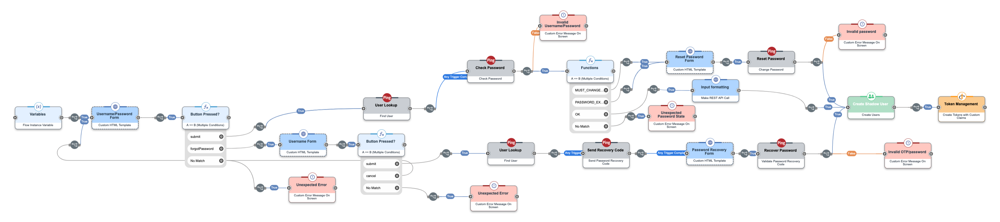

# PingOne - Sign On and Password Reset

Used to create authentication flows and includes the ability for users to reset or recover their passwords.

## Flow Image



## Metadata

**FLOW STATUS**: Enabled

### Recorded IDs

| Setting                | Value                                  |
|------------------------|----------------------------------------|
| Company/Environment ID | `56352fdf-5280-44e0-89c6-e9164b8cbe6b` |
| Customer ID            | `1113be5e6ff89abafb4875bddd037c14`     |
| Flow ID                | `3587972568663973d58d93cd015e7a5c`     |

### Versioning

| Setting                | Value                                  |
|------------------------|----------------------------------------|
| Current Version        | `0`                                    |
| Published version      | `0`                                    |
| Version ID             | `3587972568663973d58d93cd015e7a5c`     |

## Flow Settings

An exhaustive list of settings including defaults.

| Setting                          | Value                                                                                                                                                                                   |
|----------------------------------|-----------------------------------------------------------------------------------------------------------------------------------------------------------------------------------------|
| PingOne Flow                     | `false`                                                                                                                                                                                 |
| Require Authentication to Initiate flow  | `false`                                                                                                                                                                                 |
| Enable Content Security Policy   | `false`                                                                                                                                                                                 |
| CSP Value                        | `worker-src 'self' blob:; script-src 'self' https://cdn.jsdelivr.net https://code.jquery.com https://devsdk.singularkey.com http://cdnjs.cloudflare.com 'unsafe-inline' 'unsafe-eval';` |
| Intermediate Loading Screen CSS  | *Intentionally Blank*                                                                                                                                                                   |
| Intermediate Loading Screen HTML | *Intentionally Blank*                                                                                                                                                                   |
| Debug Mode                       | <span style="color:red"><strong>true</strong></span>                                                                                                                                    |
| CSS Links                        | * `https://assets.pingone.com/ux/end-user/1.7.0/end-user.css`                                                                                                                           |

### Flow Diagram


### Custom CSS

~> Note: Custom CSS is applied to every node in the flow

```css
body, .page {
  background-color: #ededed !important;
}

.buttonLink {
  background: none !important;
  border: none;
  cursor: pointer;
  color: #2996cc;
  font-size: 15px;
}
```

## Variables

The following are variables configured in the "Input Schema" of the flow.

*None configured*

## Connections

The following are connections used in the flow.

*None configured*

## Connectors

The following are connectors used in the flow.  The following just lists the nodes per connector, and provides links to documentation that describe each node's settings.

### PingOne Connector

Ping Identity online documentation: [PingOne Connector](https://docs.pingidentity.com/r/en-us/davinci-pingone-connector/davinci_pingone_connector)

| Node ID    | Node Name   | Node Title         | Capability         | Docs Link |
|------------|-------------|--------------------|--------------------|-----------|
| <a name="icv9ot1nro"></a>`icv9ot1nro` | `PingOne SSO` | `User Lookup`        | User Lookup        | [Link](./nodes/icv9ot1nro.md) |
| <a name="dnu7jt3sjz"></a>`dnu7jt3sjz` | `PingOne SSO` | `Check Password`     | Check Password     | [Link](./nodes/dnu7jt3sjz.md)      |
| <a name="fhz3x7ukuh"></a>`fhz3x7ukuh` | `PingOne SSO` | `Send Recovery Code` | Send Recovery Code | [Link](./nodes/fhz3x7ukuh.md)      |
| <a name="lo3onszyab"></a>`lo3onszyab` | `PingOne SSO` | `Recover Password`   | Recover Password   | [Link](./nodes/lo3onszyab.md)      |
| <a name="ldguma4s6x"></a>`ldguma4s6x` | `PingOne SSO` | `Reset Password`     | Reset Password     | [Link](./nodes/ldguma4s6x.md)      |
| <a name="o9qu0nvyje"></a>`o9qu0nvyje` | `PingOne SSO` | `User Lookup`        | User Lookup        | [Link](./nodes/o9qu0nvyje.md)      |

### Error Connector

Ping Identity online documentation: [Error Customize Connector](https://docs.pingidentity.com/r/en-us/davinci-error-customize-connector/davinci_error_customize_connector)

| Node ID    | Node Name   | Node Title         | Capability         | Docs Link |
|------------|-------------|--------------------|--------------------|-----------|
| <a name="0mkskx7cez"></a>`0mkskx7cez` | `Error`       | `Unexpected Error`   | Custom Error Message | [Link](./nodes/0mkskx7cez.md)      |
| <a name="kkii6sbmvk"></a>`kkii6sbmvk` | `Error`       | `Invalid Username/Password` | Custom Error Message | [Link](./nodes/kkii6sbmvk.md)      |
| <a name="xe7a3y02pq"></a>`xe7a3y02pq` | `Error`       | `Invalid OTP/password` | Custom Error Message | [Link](./nodes/xe7a3y02pq.md)      |
| <a name="7ohg6pe1wu"></a>`7ohg6pe1wu` | `Error`       | `Invalid password`   | Custom Error Message | [Link](./nodes/7ohg6pe1wu.md)      |
| <a name="nf63ecqmal"></a>`nf63ecqmal` | `Error`       | `Unexpected Password State` | Custom Error Message | [Link](./nodes/nf63ecqmal.md)      |
| <a name="qib48jbqzt"></a>`qib48jbqzt` | `Error`       | `Unexpected Error`   | Custom Error Message | [Link](./nodes/qib48jbqzt.md)      |

### Functions Connector

Ping Identity online documentation: [Functions Connector](https://docs.pingidentity.com/r/en-us/davinci-function-connector/davinci_function_connector)

| Node ID    | Node Name   | Node Title         | Capability         | Docs Link |
|------------|-------------|--------------------|--------------------|-----------|
| <a name="uob50pnvdv"></a>`uob50pnvdv` | `Functions` | `Button Pressed?` | A Equals Multiple B | [Link](./nodes/uob50pnvdv.md)    |
| <a name="3of58vu7g8"></a>`3of58vu7g8` | `Functions` | *None*           | A Equals Multiple B | [Link](./nodes/3of58vu7g8.md)     |
| <a name="tqhsdpjiev"></a>`tqhsdpjiev` | `Functions` | `Button Pressed?` | A Equals Multiple B | [Link](./nodes/tqhsdpjiev.md)    |

### HTTP Connector

Ping Identity online documentation: [HTTP Connector](https://docs.pingidentity.com/r/en-us/davinci-http-connector/davinci_http_connector)

| Node ID    | Node Name   | Node Title         | Capability         | Docs Link |
|------------|-------------|--------------------|--------------------|-----------|
| <a name="k1vc9enhqp"></a>`k1vc9enhqp` | `Http`    | `Recover Password` | Custom HTML Template | [Link](./nodes/k1vc9enhqp.md)      |
| <a name="j9ekv98w5p"></a>`j9ekv98w5p` | `Http`    | `Reset Password Form` | Custom HTML Template | [Link](./nodes/j9ekv98w5p.md)      |
| <a name="howu8n9hsc"></a>`howu8n9hsc` | `Http`    | `Username/Password Form` | Custom HTML Template | [Link](./nodes/howu8n9hsc.md)      |
| <a name="8m0sspk0ee"></a>`8m0sspk0ee` | `Http`    | `Username Form`   | Custom HTML Template | [Link](./nodes/8m0sspk0ee.md)      |

### OpenID Connector

Ping Identity online documentation: *None*

| Node ID    | Node Name   | Node Title         | Capability         | Docs Link |
|------------|-------------|--------------------|--------------------|-----------|
| <a name="ck1mtmjp5b"></a>`ck1mtmjp5b` | `Token Management` | *None* | Create Session With Custom Claims | [Link](./nodes/ck1mtmjp5b.md)      |

### User Policy Connector

Ping Identity online documentation: *None*

| Node ID    | Node Name   | Node Title         | Capability         | Docs Link |
|------------|-------------|--------------------|--------------------|-----------|
| <a name="760w48p7zi"></a>`760w48p7zi` | `User Policy` | `Create Shadow User` | Create User  | [Link](./nodes/760w48p7zi.md)      |

### Variables Connector

Ping Identity online documentation: *None*

| Node ID    | Node Name   | Node Title         | Capability         | Docs Link |
|------------|-------------|--------------------|--------------------|-----------|
| <a name="lz4v4r9c4m"></a>`lz4v4r9c4m` | `Variables` | *None*           | Variables          | [Link](./nodes/lz4v4r9c4m.md)      |
