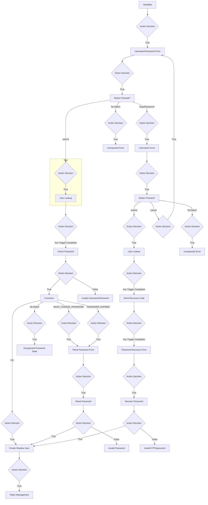

# "User Lookup" - PingOne Connector (ID: icv9ot1nro)

**Action** Find User

## Configuration

### General Settings

| Setting                | Static Value  | Variable  |  
|------------------------|----------------------------------------|-------------------|
| PingOne Attributes | - `username` | N/a |
| Identifier| N/a | `username` from "Username/Password Form" (Node ID: [howu8n9hsc](./howu8n9hsc.md)) |
| Return User Password Status | Disabled | N/a |

### Canvas Settings

| Setting                | Static Value  | Variable  |  
|------------------------|----------------------------------------|-------------------|
| Node Title | `User Lookup` | N/a |
| Node Description | *Not configured* | N/a |
| Node Background Color | *Not configured* | N/a |
| Expire Authentication Token | *Not configured* | N/a |
| Expire Flow Instance Cache | *Not configured* | N/a |
| Expire Node Instance Cache | *Not configured* | N/a |
| Expire Node Instance Cache List | *Not configured* | N/a |

## Flow Posture

### Previous Nodes

* **Node**: "Button Pressed?" Function Connector (Node ID: [uob50pnvdv](./uob50pnvdv.md))
  * **Condition**: `submit`
    * **Action Decision**: `true`

### Following Nodes

* **Action Decision**: `Any trigger completes`
  * **Node**: "Check Password" PingOne Connector (Node ID: [dnu7jt3sjz](./dnu7jt3sjz.md))

## Data Flow Posture

### Output variables referenced in the flow

The following variables are set as output variables of this node, with any nodes that refer to this variable directly.

* `matchedUser.Id` ([Link](../data/icv9ot1nro_payload_output_matcheduser_id.md))
  * "Check Password" PingOne Connector (Node ID: [dnu7jt3sjz](./dnu7jt3sjz.md))
  * "Reset Password" PingOne Connector (Node ID: [ldguma4s6x](./ldguma4s6x.md))

### Referenced input variables

The following variables are set in nodes earlier in the flow, and are referenced in this node.

* `username` ([Link](../data/howu8n9hsc_payload_output_username.md))
  * "Username/Password Form" HTTP Connector (Node ID: [howu8n9hsc](./howu8n9hsc.md))
