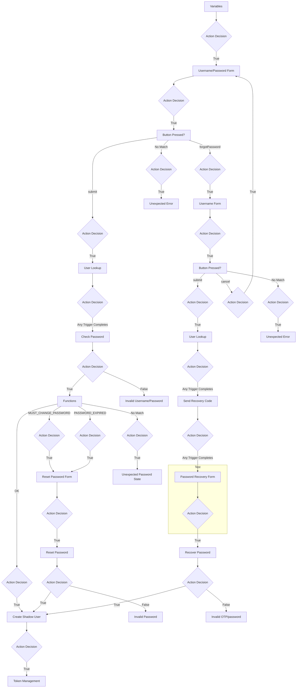

# k1vc9enhqp - "Password Recovery Form" - HTTP Connector

**Action** Custom HTML Template

## Configuration

### General Settings

| Setting                | Static Value  | Variable  |  
|------------------------|----------------------------------------|-------------------|
| Select UI Template | *Not configured* | N/a |
| Use Recaptcha Verification | *Not configured* | N/a |
| Challenge | *Not configured* | N/a |

#### Output Fields List

| Property Name  | Preferred Control Type | Preferred Data Type | Value                 | Hashed Visibility | Display Name    |
|----------------|------------------------|---------------------|-----------------------|-------------------|-----------------|
| `recoveryCode` | textField              | string              | *Intentionally Blank* | `false`           | `Recovery Code` |
| `newPassword`  | textField              | string              | *Intentionally Blank* | `true`            | `New Password`  |
| `buttonValue`  | textField              | string              | *No value*            | *No value*        | *No value*      |

#### Form Validation Rules

*None configured*

#### HTML Template

```html
<div class="app-container" style="display: block;">
	<div class="page__content" style="height: 100%;">
		<div class="card card--no-padding">
            <div class="card__content">
                <div class="org-logo">
                    
                </div>
                <h1 class="heading" data-id="heading">Enter New Password</h1>
                <h4 class="heading heading--4" data-id="heading" style="text-align: center;">If you have an active account with a valid email address, you will receive an email with a recovery code which you may enter here, along with a new password. If you do not have an account or email, please contact your administrator to recover your password.			</h4>
                <div data-skcomponent="skerror" class="feedback feedback--error sk-alert sk-alert-danger has-text-danger has-background-danger-light" data-skvisibility=""></div>
                <form class="form" id='recoveryCodeForm' data-id="recoveryCodeForm">
                    <div class="field float-label">
                        <input class="text-input float-label__input" data-id="recoveryCode-input" id="recoveryCode" name="recoveryCode" type="text" value="" />
                        <label class="float-label__label" for="recoveryCode">Recovery Code</label>
                    </div>
                    <div class="field float-label">
                        <input class="text-input text-input--pasword float-label__input" data-id="newPassword-input" id="newPassword" name="newPassword" type="password" value="" />
                        <label class="float-label__label" for="newPassword">New Password</label>
                    </div>
                    <div class="control">
                        <button class="field is-primary mt-2 button file-input--button button--primary brand-primary-bg" data-id="button" type="submit" data-skcomponent="skbutton" data-skbuttontype="form-submit" data-skform="recoveryCodeForm" data-skbuttonvalue="submit">
                            Submit
                            <i class="fas fa-forward ml-2"></i>
                        </button>
                    </div>
                </form>
            </div>
		</div>
	</div>
</div>

```

#### CSS

*Not configured*

#### Script

*Not configured*

#### Input Schema

*Not configured*

#### Output Schema

*Not configured*

### Canvas Settings

| Setting                | Static Value  | Variable  |  
|------------------------|----------------------------------------|-------------------|
| Node Title | `Password Recovery Form` | N/a |
| Node Description | *Default* | N/a |
| Node Background Color | *Default* | N/a |
| Expire Authentication Token | *Default* | N/a |
| Expire Flow Instance Cache | *Default* | N/a |
| Expire Node Instance Cache | *Default* | N/a |
| Expire Node Instance Cache List | *Default* | N/a |

## Flow Posture



### Previous Nodes

* **Node**: "Send Recovery Code" PingOne Connector (ID: [fhz3x7ukuh](./fhz3x7ukuh.md))
  * **Action Decision**: `Any trigger completes`

### Following Nodes

* **Action Decision**: `true`
  * **Node**: "Recover Password" PingOne Connector (ID: [lo3onszyab](./lo3onszyab.md))
